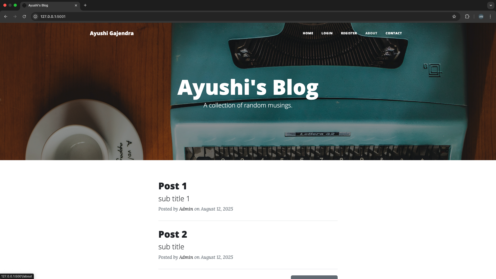

# 📝 Flask Blog App

A full-featured Flask Blog Application with:
- User authentication (register, login, logout)
- Post creation, editing, and deletion
- Rich-text editing with CKEditor
- Responsive design with Bootstrap 5
- Secure password hashing (Werkzeug)
- SQLite database with SQLAlchemy ORM

---

## 📸 Demo



---

## 🚀 Features

- User registration & login (with hashed passwords)
- Create, edit, delete blog posts (admin only)
- View all posts and individual posts
- Comment functionality
- Responsive UI using Flask-Bootstrap
- Rich-text editing with Flask-CKEditor
- Database models with SQLAlchemy ORM

---

## 🛠️ Tech Stack

- Backend: Flask

- Database: SQLite (via SQLAlchemy ORM)

- Frontend: Bootstrap 5 + Jinja Templates

- Authentication: Flask-Login

- Forms & Validation: Flask-WTF

- Password Security: Werkzeug

---

## 📂 Project Structure
```

flask-blog/
│── static/              # CSS, images, JS
│── templates/           # HTML templates
│   ├── index.html       # homepage showing all posts
│   ├── register.html    # user registration
│   ├── login.html       # user login
│   ├── post.html        # individual blog post
│   ├── make-post.html   # create/edit blog post
│   ├── about.html       # static about page
│   └── contact.html     # static contact page
│── forms.py             # Flask-WTF form classes
│── app.py               # main Flask application
│── posts.db             # SQLite database (auto-created when running)
│── requirements.txt     # project dependencies
│── README.md            # documentation

```

## ⚡ Installation & Setup

1. Clone the repo

```
git clone https://github.com/ayushi-gajendra/KeepUp_blog_website.git
cd KeepUp_blog_website
```

2. Create a virtual environment & activate it
```
python -m venv venv
source venv/bin/activate   # Mac/Linux
venv\Scripts\activate      # Windows
```

3. Install dependencies
```
pip install -r requirements.txt
```

4. Run the app
```
python app.py
```

## 📦 Requirements

Add these to your requirements.txt:

- Flask
- Flask-Bootstrap
- Flask-CKEditor
- Flask-WTF
- Flask-Login
- Flask-SQLAlchemy
- Werkzeug

## 🔑 Admin Controls

Only admin users can:
- Create new posts
- Edit posts
- Delete posts
